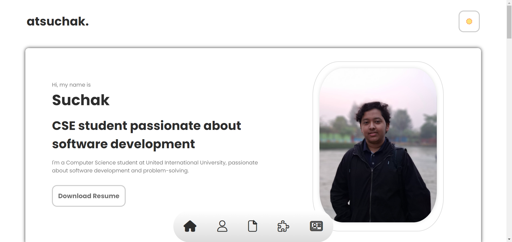

# ✨ Ahnaf Tajwar Suchak - Personal Portfolio

A sleek, responsive personal portfolio showcasing my skills and passion for software development and problem-solving. This site serves as a dynamic resume and a hub for my creative endeavors.

<div align="center">
    
</div>

[](https://www.google.com/search?q=https://atsuchak.github.io/atsuchak.github.io/)
[](https://www.google.com/search?q=https://github.com/atsuchak/atsuchak.github.io)

-----

## 🙋‍♂️ About Me

I'm a Computer Science student at United International University, passionate about software development and problem-solving. I'm an intermediate web developer eager to craft user-friendly solutions and tackle challenging problems. Beyond academics, my interests include competitive programming and exploring diverse fields within computer science, from AI to systems design.

-----

## ✨ Features

  * **Responsive Design**: Ensures a seamless experience across all devices.
  * **Dark Mode Toggle**: Easily switch between light and dark themes for comfortable viewing.
  * **Smooth Navigation**: Intuitive bottom navigation bar with smooth scrolling to various sections.
  * **Dynamic Active Navigation**: Navigation icons dynamically update to highlight the current section as you scroll.
  * **Interactive Contact Form**: A fully functional form powered by Formspree, allowing direct communication.

-----

## 🛠️ Tech Stack

  * **Frontend**: HTML5, CSS3, JavaScript
  * **Styling**: CSS Flexbox, Grid, custom variables for theming
  * **Icons**: Font Awesome
  * **Fonts**: Google Fonts (`Poppins`, `Roboto`)
  * **Form Handling**: Formspree

-----

## ⚙️ Getting Started

To get a local copy of this portfolio up and running, follow these simple steps:

1.  **Clone the repository:**
    ```bash
    git clone https://github.com/atsuchak/atsuchak.github.io.git
    ```
2.  **Navigate to the project directory:**
    ```bash
    cd atsuchak.github.io
    ```
3.  **Open `index.html` in your preferred web browser.**

No additional dependencies are needed to run this project locally\!

-----